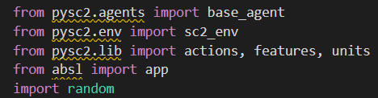
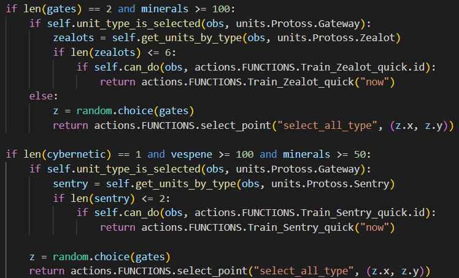
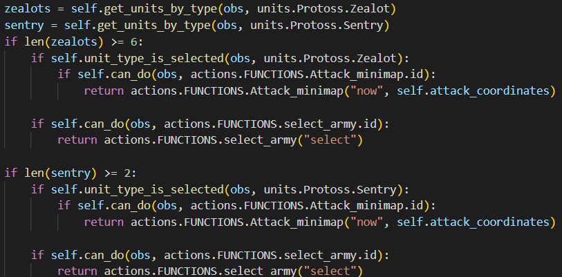

# Smart Protoss by J. Olmos - A01275595

## Introduction
Artificial intelligence is defined as the study of rational agents. A rational agent could be anything that makes decisions, as a person, firm, machine, or software (Bansall, 2022).

Taking that into account, this proyect centers itself in creating a simple reflex protoss Agent.

## Important information before starting

We will need to install the following in our computers before using the Agent:
- Battle.net Launcher
    - Required for downloading Starcraft 2
- Starcraft 2
    - The game on which the agent will run
- Python
    - Language used for programming the agent
- pysc2
    -  DeepMind's Python component of the StarCraft II Learning Environment (SC2LE)

#### For a full guide on how to install all of this just use the next youtube link: https://www.youtube.com/watch?v=KYCxZBghVZ8

## How does it work?
As you can imagine, it all comes down to the [script](Smart_Protoss.py). If this is your first time working with AI, there is no need to worry because we'll explain the whole code up next.

### 1. Importing variables
These variables will be used for controlling and using the agent and environment settings.

### 2. Defining our very own Protoss class
We will define the Protoss class, which will determine the behaviour of the Protoss Agent.

### 3. Defining the step function
Inside the Protoss_Agent class, we'll declare this function. Its purpose will provide all of the actions that  the agent will do.

### 4. Defining the main function (Game environment)
Here, we´ll configure several game elements for the environment in which the agent will develop.
As seen on the coments, we can change several values of the stablished variables.
- map_name ="Simple64"
    - If we did the correct instalation, we can could choose another map inside the Melee folder
- sc2_env.Bot(sc2_env.Race.random, sc2_env.Difficulty.very_easy)
    - Instead of Race.random, we can choose any of the available races to battle the Agent, we can choose: terran, protoss or zerg.
    - Instead of Difficulty.very_easy, we could choose an of the available difficulties in which the enemy bot will have its units, we can choose: easy, medium, medium_hard, hard, harder, very_hard, cheat_vision, cheat_money, cheat_insane. 
- step_mul = 1
    - This will show the speed at wich the game is played, 1 appears to be the slowest.
- game_steps_per_episode = 0
    - This will determine the duration of the game, in this case, 0 means that it will last as long as it needs.

### 5. Complementary functions
These functions are complementary for the agent and will make its life more easy.
1. _ _init_ _ defines a constructor and define to None both first_pylon and the attack_coordinates because, the game has just started. It will be inside the Protoss_Agent class previously created.

2. unit_type_is_selected will check if the input unit is selected, being single or multy select.

3. get_units_by_type returns a list with instances of the input unit or units.

4. can_do is a very important function, because it will check if the input action is available or not.

### 6. Completing Step
As its name inquires, we´ll be completing our Step function

Firts and foremost, we need to define where are we in the map, thus obtaining xmean and ymean.
Now that we know were we are, it's easy to know where the enemy is, so we just simply define our attack_coordinates.

Resource gathering and knowledge of how much of them we have is important for creating almost everything, so we simply define that variables to obtain a counter of minerals and vespene's.

#### Pylons

Because we are playing as Protoss, we'll need to use Pylons.
The game describes Pylons as: 
> Provides supply. Supply allows one to warp  more units, creates power for nearby structures.

Basically, Pylons are power outlets, indispensable for more powerfull structures.

I like the number 5, so until we have 5 built Pylons and have more than 100 minerals (Which is the price of building a Pylon), we'll check if a Prove is selected in order for it to being able to Warp Pylons. If we have it selected, our random function comes in handy to produce possible values in which the Pylon will be warped. 

#### Gateways and Assimilators
Gateways are described in game as:
> Warps in Protoss ground units

While Assimilators are described as:
> Protoss structure used for harvesting Vespene Gas

gates variable will return a list of Gateway objects. Then, we'll check if we have 2 gateways built and ≥ 150 minerals (Cost of the Gateway). Once we have resources, We check if a Probe is selected in order to Warp the Gateway in a random location.

Nothing changes substancially for warping an Assimilator other than the cost of the minerals for warping it (Should be 75 at least).

#### Cybernetics Core

In order to use more than just Zealots for attacking the enemy player, we need to build at least one Cybernetics Core.
The steps are the same as all of the avobe, except the cost to build the Cybernetics Core, wich sould be at least 150 minerals worth.

#### Zealots and Sentrys
Now that we have all of our Structures ready, we can start training Zealots and Sentrys.

In game description of Zealots include but its not limitted to:
> Can attack ground units

In the other hand, Sentrys are described as:
> Ergy manipulator units. Can use ForceField, Guardian Shield and Hallucination.

Pretty cool, right?

We first check for our 2 gateways and that we at least have 100 minerals, we then procede to verify that a gateway is indeed selected, if thats not the case, we select a random gateway. We should limit our zealots to a number that we want, in this case i liked 6 so each gateway will only Warp 6 Zealots.

Same story with the Sentrys but this time, both our Minerals and Vespene will be taken in consideration. Sentrys are cool but we might not need so many of them, so I choose to limit Sentrys to only 1 per Gateway.

#### Probes
> Used to gather resources and Warp Protoss structures.

I would consider Probes to be the most important unit in the game, withouth them we cant do anything. And in order for us to do anything, we need to verify that they are selected.

#### Winning
Now that we have everything ready, its time to take the ofensive.

To start, we need to make sure we have at least 6 Zealot units trained. If thats the case, we select them and make sure that we can actually send them to attack the enemy.

Story repeats itself with the Sentry, but in this case we only check for 1

## References
- Bansall, S. (2022, August 22). geeksforgeeks.org. https://www.geeksforgeeks.org/agents-artificial-intelligence/
- Valdés B. (2019, August 19). Pysc2 install process. YouTube. https://www.youtube.com/watch?v=KYCxZBghVZ8